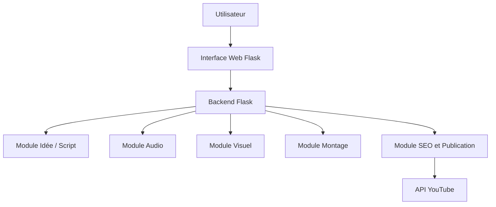
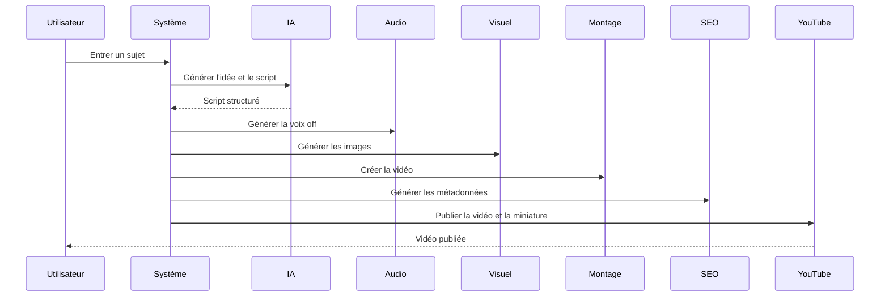

# Cahier des charges

## Système intelligent d'automatisation de création de vidéos YouTube

### 1. Contexte général

Avec l'essor des plateformes de diffusion comme YouTube, la création de contenu vidéo est devenue un levier important pour la communication, le marketing et l'éducation. Cependant, produire régulièrement des vidéos de qualité demande du temps, des compétences techniques et des ressources humaines.

Ce projet propose un système assisté par IA capable d'automatiser la chaîne de production de vidéos YouTube à partir d'un simple sujet.

### 2. Problématique

Comment concevoir un système intelligent capable de générer automatiquement des vidéos YouTube optimisées sur le fond et sur le référencement, tout en conservant une qualité acceptable et un bon potentiel d'engagement ?

### 3. Objectifs du projet

#### Objectif principal

Développer une plateforme capable de générer automatiquement une vidéo complète à partir d'un sujet saisi par l'utilisateur.

#### Objectifs secondaires

- Générer automatiquement des idées et angles éditoriaux.
- Générer un script structuré.
- Produire une voix off réaliste.
- Produire des visuels adaptés.
- Monter automatiquement la vidéo.
- Générer les métadonnées SEO.
- Générer une miniature YouTube.
- Générer des chapitres et des hashtags dans la description.
- Publier automatiquement sur YouTube.

### 4. Utilisateurs cibles

- Créateurs de contenu débutants.
- Marketeurs digitaux.
- Entreprises.
- Étudiants et enseignants.

### 5. Périmètre fonctionnel

#### 5.1 Génération d'idées

- Extraction d'éléments clés à partir du sujet.
- Production d'un angle principal.
- Analyse de tendance multi-signal: intention de recherche, adéquation au format, timeliness et potentiel d'engagement.
- Proposition d'angles secondaires.

#### 5.2 Génération de script

- Structure en trois parties : introduction, développement et conclusion.
- Résumé du script en sections exploitables par le reste de la chaîne.
- Support d'une génération locale de secours quand l'API externe n'est pas disponible.

#### 5.3 Génération audio

- Conversion texte vers audio.
- Sélection de voix homme ou femme.
- Intégration ElevenLabs.
- Fallback local si la clé API manque ou si l'appel échoue.

#### 5.4 Génération de contenu visuel

- Génération d'images IA via Hugging Face.
- Création de visuels de secours locaux si le service externe n'est pas disponible.
- Traçabilité de la provenance des images.

#### 5.5 Montage automatique

- Assemblage automatique des scènes.
- Ajout de transitions.
- Export en MP4.
- Génération automatique d'un fichier SRT de sous-titres à partir des scènes.
- Mux audio lorsque la piste vocale est disponible.

#### 5.6 Publication automatique

- Génération du titre, de la description et des tags.
- Génération automatique des chapitres à partir du script.
- Ajout automatique de hashtags.
- Upload vidéo via l'API YouTube Data.
- Upload de miniature séparé.

### 6. Architecture du système

### 7. Choix technologiques

#### Backend

- Python
- Flask
- Flask-SQLAlchemy

#### Intelligence artificielle

- Hugging Face Inference API pour le script et les images.
- ElevenLabs pour la synthèse vocale.

#### Audio et vidéo

- Pillow
- imageio
- imageio-ffmpeg
- NumPy
- FFmpeg via imageio-ffmpeg

#### Base de données

- SQLite pour le prototype local.

#### API externe

- YouTube Data API
- Hugging Face Inference API
- ElevenLabs API

### 8. Modélisation des données

#### Entités principales

- Video
  - id
  - titre
  - description
  - script
  - url
  - chemins d'artefacts

- User
  - id
  - nom
  - email

- Analytics
  - id
  - vues
  - likes
  - CTR
  - watch time

### 9. Diagramme de séquence

### 10. Contraintes

#### Techniques

- Temps de génération raisonnable.
- Gestion des indisponibilités d'API externes.
- Conservation d'une chaîne de secours locale.

#### Légales

- Respect des droits d'auteur.
- Conformité aux règles de publication YouTube.

#### Qualité

- Audio clair.
- Vidéo fluide.
- Métadonnées cohérentes.

### 11. Critères de performance

- Temps de génération court pour une démonstration MVP.
- Qualité audio acceptable.
- Score SEO élevé.
- Score de tendance cohérent avec le sujet et l'audience.
- Description enrichie avec chapitres et hashtags.
- Publication reproductible.

### 12. Évolutions futures

- Apprentissage basé sur les performances des publications.
- Tableau de bord analytique avancé.
- Recommandation automatique de contenu.
- Support multilingue étendu.
- Intégration d'un moteur de tendances YouTube plus avancé.

### 13. MVP

#### Version compétition 2 à 3 heures

Fonctionnalités minimales :

- Saisie d'un sujet.
- Génération d'un script.
- Génération d'une voix off.
- Génération d'une miniature simple.
- Génération d'une courte vidéo.

### 14. Conclusion

Ce projet propose une solution innovante basée sur l'intelligence artificielle pour automatiser la production de contenu vidéo sur YouTube. Il couvre les principales étapes de la chaîne de production: idée, script, audio, visuels, montage, SEO, miniature, sous-titres et publication.

### 15. Correspondance avec l'implémentation actuelle

| Exigence | Implémentation actuelle |
|---|---|
| Génération d'idées | `app/services/idea_service.py` |
| Génération de script | `app/services/script_service.py` |
| Génération audio | `app/services/audio_service.py` |
| Génération de visuels | `app/services/visual_service.py` |
| Montage vidéo | `app/services/render_service.py` |
| Sous-titres automatiques | `app/services/render_service.py` génère un fichier SRT |
| SEO | `app/services/seo_service.py` |
| Miniature | `app/services/thumbnail_service.py` |
| Publication YouTube | `app/services/youtube_service.py` |
| Orchestration | `app/services/pipeline.py` |
| API web | `app/api/routes.py` |

### 16. Notes de soutenance

- Le projet utilise une architecture modulaire pour isoler chaque étape du pipeline.
- Chaque étape produit des artefacts JSON inspectables.
- Le système fonctionne avec ou sans clés API externes grâce aux fallbacks locaux.
- Le périmètre est démontrable en version MVP, tout en restant évolutif.

### 17. Conformité UX/UI de l'interface actuelle

L'interface web a été alignée sur les consignes de design du projet avec une implémentation native Flask/HTML/CSS/JS, tout en conservant l'intention fonctionnelle demandée.

- Conteneur centré avec largeur maximale et hiérarchie visuelle claire.
- Hero section avec titre, sous-titre et CTA principal.
- Barre d'en-tête avec logo, titre et accès rapide à la conformité.
- Formulaire en carte premium avec ombres douces, arrondis importants et champs espacés.
- Champs à labels flottants ou libellés modernes pour une lecture immédiate.
- Palette claire inspirée d'un SaaS premium: vert forêt, gris clair et bleu ciel.
- Effets glassmorphism, ombres souples, survols et transitions fluides.
- Animations d'entrée, fond subtil animé, spinner de chargement et barre de progression.
- Section de résultat dédiée avec aperçu du script, des artefacts et de la lecture de tendance.
- Section de conformité pour rendre visible le lien entre le cahier des charges et l'implémentation.

Remarque: les consignes mentionnant React, Lucide et Framer Motion sont respectées sur le plan UX par des équivalents natifs dans cette version Flask, afin de rester cohérent avec la base de code existante.
